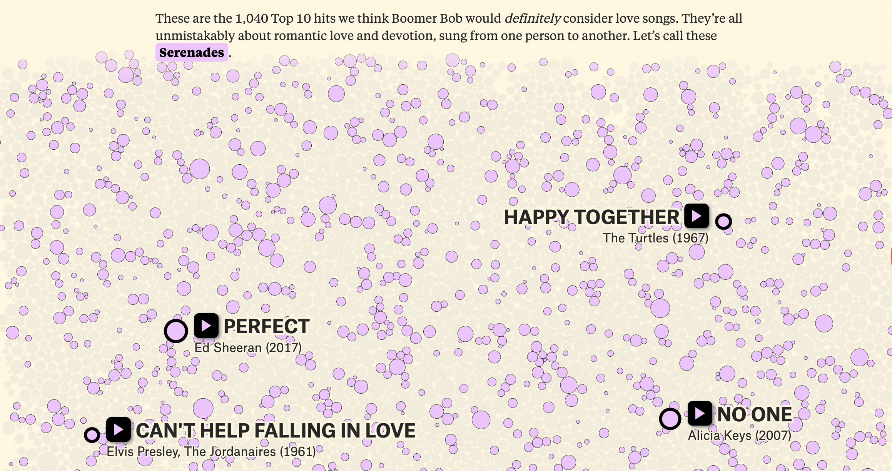
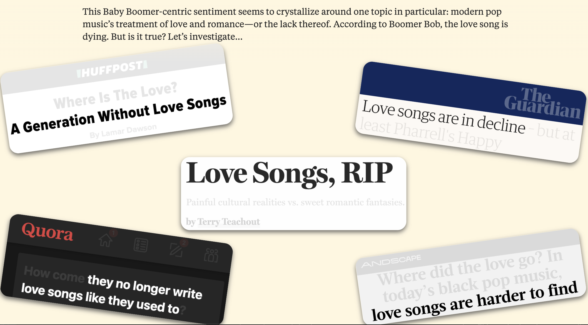
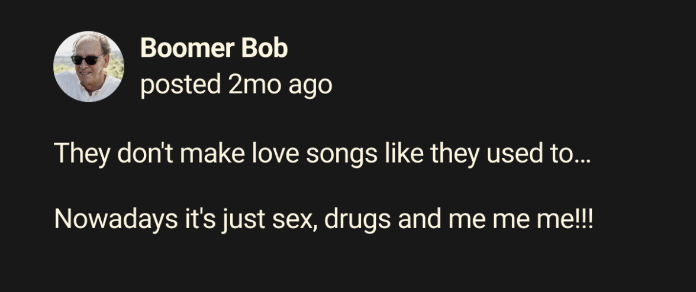

# ¿Se están acabando las canciones de amor?
**Is the love song dying?**

Así se llama la webstory creada por **David Mora y Michelle Jia** , en dónde exploran la popularidad de las canciones de amor a lo largo de los años. 
La historia hace una revisión de la evolución de las canciones de amor en la música popular a lo largo de las décadas. Analiza cómo la frecuencia y la naturaleza de las canciones de amor han cambiado con el tiempo, sugiriendo una disminución en años recientes. ​

La historia utiliza datos y visualizaciones interactivas para ilustrar estas tendencias y plantea preguntas sobre las razones detrás de este cambio en la temática musical.

## ¿Por qué me gustó tanto?
1. Es interactiva
2. Tiene colores llamativos
3. Tiene información adicional hipervinculada para poder acceder al contenido al que se refieren
4. Las diapositivas no están saturadas de información. 
5. Tiene continuidad

Debo reconocer que yo soy la típica persona que se queja de que las páginas web son feas, que son inútiles y que la era digital arruina todo lo bueno. Por este mismo motivo, las historias web me han hecho encariñarme poco a poco de esta modalidad e incluso creo que las consumo mucho más que antes. El formato de esta en específico me mantuvo pendiente hasta el final, realmente interesada e interactuando con el contenido. Me metí a revisar los links, los videos de las canciones e incluso revisé detalladamente los datos de los gráficos, algo que casi nunca hago. 

Lo que más me gusto fue exactamente eso, que era tan interactiva y entretenida que me quedé hasta el final. La historia estaba respaldada con muchos datos, pero no lo parecía ya que era muy ameno a simple vista y estaba bien distribuido.

Me llamó mucho la atención que uno de sus principales recursos fue que ocuparon una historia que era el hilo conductor de la investigación, un comentario del usuario "Boomer Bob". A lo largo de la historia volvían al comentario, dándole continuidad al relato. Creo que es una manera creativa de captar la atención de los usuarios y al mismo tiempo entretenida. 

### ¿Cumple con su objetivo?
Definitivamente si.

El objetivo de esta historia era analizar si es que había disminuido el consumo de canciones de amor entre los usuarios, y a lo largo del relato se va comparando por década las reproducciones de distintos géneros, artistas y canciones para responder a dicha pregunta. La historia cuenta en su mayoría con respaldo en números, pero no se hace difcil interpretarlos, por lo que es llevadero llegar hasta el final y seguirle el ritmo a esta historia. 

Finalmente, la conclusión de la investigación es incluso romántica: las canciones de amor no están muertas, si no que se reinventaron. 

_"The love song didn’t die; it evolved. People are loving, losing, and connecting in more ways than ever before. We argue that modern pop is just as love-struck as ever, just maybe in ways that Boomer Bob doesn’t recognize"._ 

https://pudding.cool/2024/11/love-songs/
